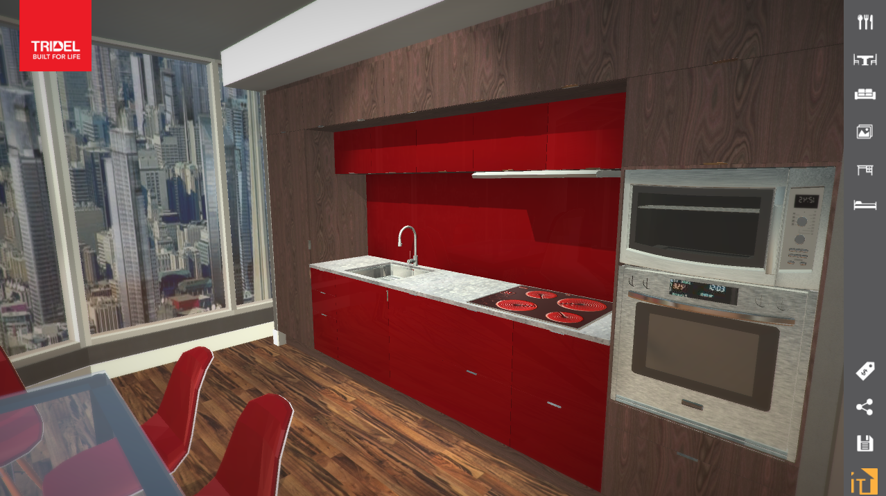
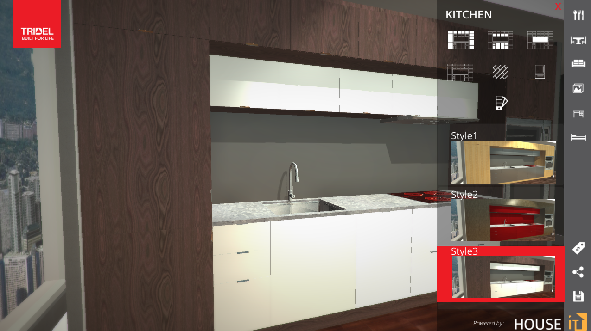
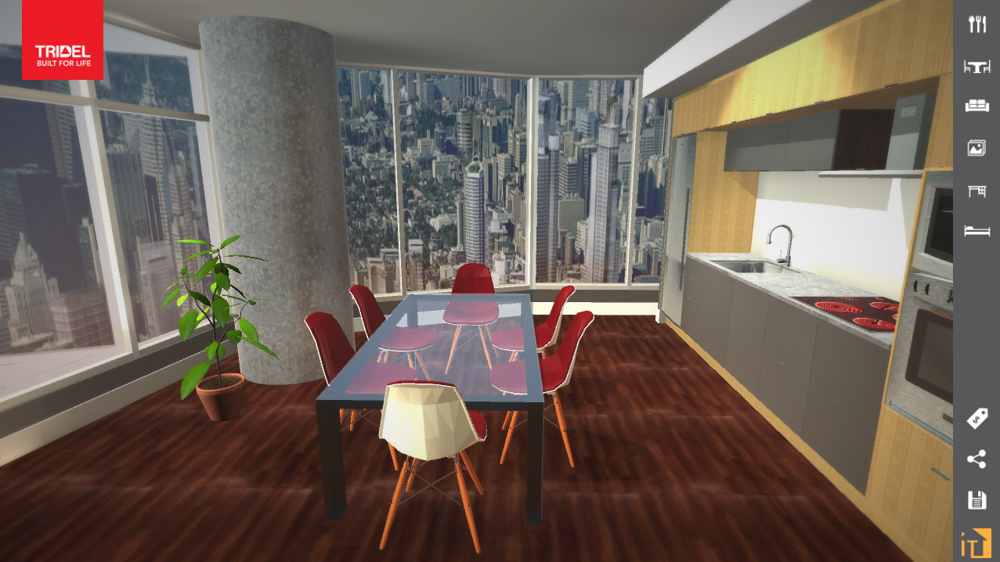
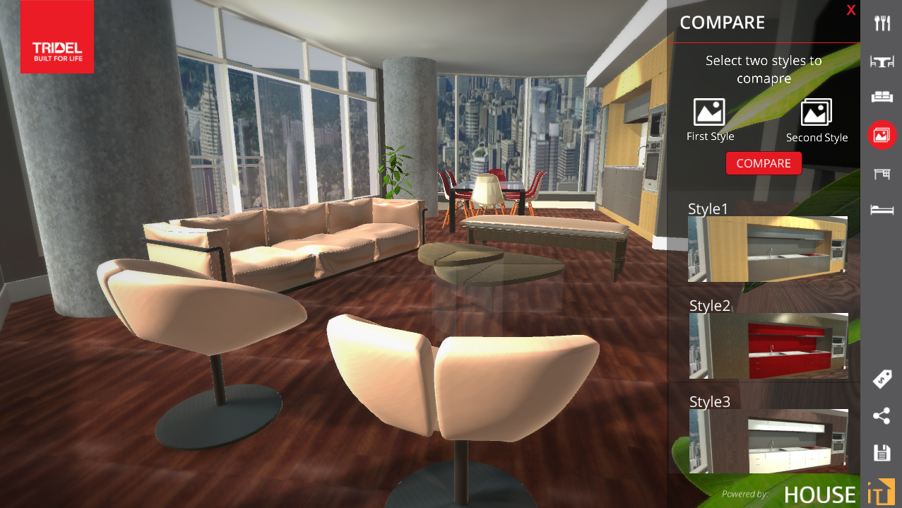
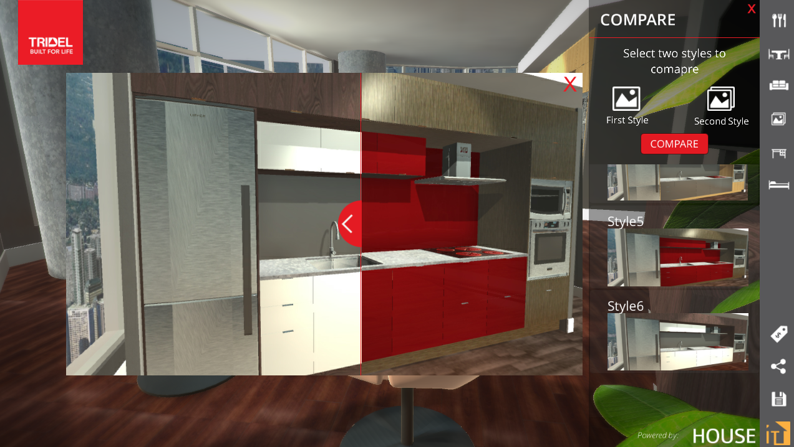
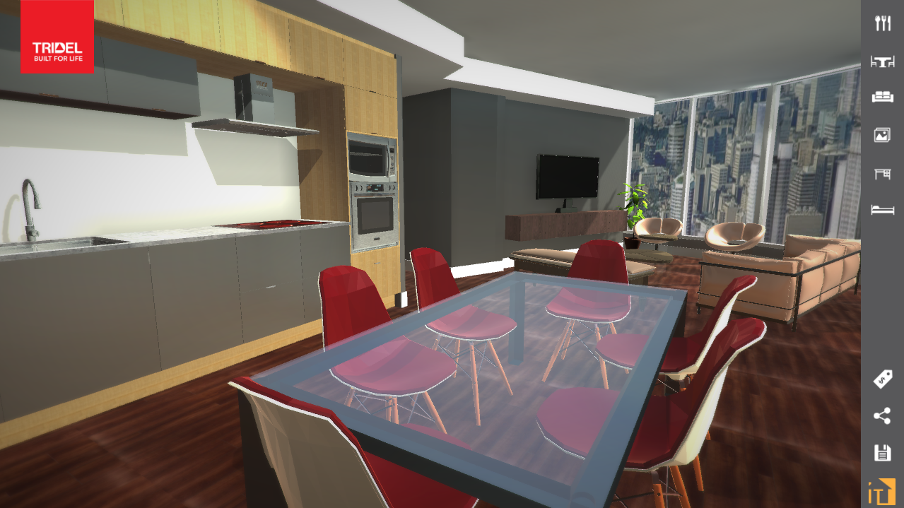

# Unity5-HouseIt-Application 

The app allows customers to go in their future condo and change design of the furniture to their liking. Software was built using best
practices with Unity 5. 
## Technology used
     
- Unity 5 was used to create it
- 3D MAX was used to create furniture objects and condo.

## Steps of creation

- Level Lightning
- Level Textures and Materials
- Application Responsive Menu
- Game logic and functionality

## Functions

- Customize and change materials of inside furniture
- Move around your future condo just with simple swipes
- Customer can choose already pre-designed styles for kitchen or other parts of the condo 
- Compare two styles together on a nicely made slider. 
- Could be released this for various platforms such as: PC(best quality), android, IOS, and Web.

## ScreenShots

Kitchen Red:

Kitchen white & menu:

Dining area:

Living room:

Slider:

Condo view:
